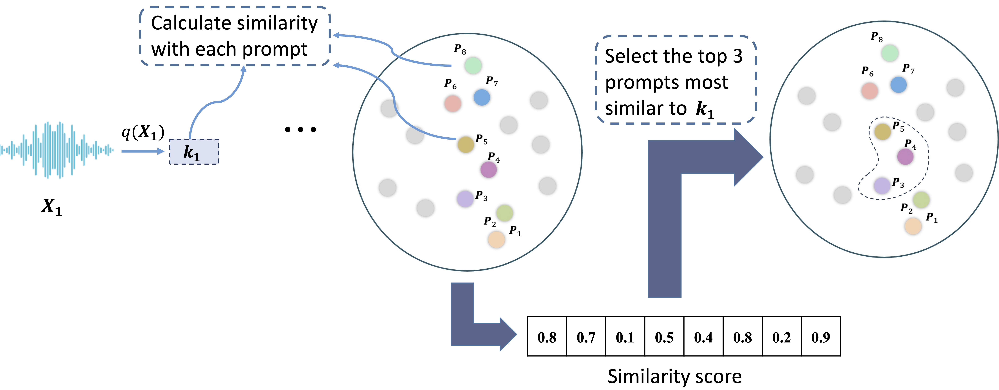

# DynamicPromptWavLM
Below is a shortened version of the provided content in Markdown format, retaining key equations and concepts. You can insert images by replacing `URL_TO_IMAGE` with actual image URLs.

---

## Dynamic Prompt Pool

Speakers during inference often differ from those used to train the speaker embedding network. Fixed utterance-dependent prompts limit generalization to unseen speakers. To overcome this, we use a **dynamic prompt pool**, where each prompt is updated by similar speakers using a dynamic selection strategy that matches prompts to Transformer layer inputs. This encourages knowledge sharing and avoids catastrophic forgetting.

We denote **Xₙ** ∈ ℝ<sup>D×T</sup> as the feature map output of the *n*-th layer before concatenating prompts, with **X₀** from the CNN encoder. The prompt pool is:


$$
\mathcal{P} = \{P_{1}, P_{2}, \ldots, P_M\},
$$

where **M** is the number of prompts and each **Pⱼ** ∈ ℝ<sup>D×T'</sup>.

---

## Instance-wise Prompt Searching

We use a dynamic key-to-prompt search strategy:

- **Key function:**  

  $$q: ℝ^{T×D} → ℝ^D,$$   
  where **kᵢ = q(Xᵢ)**.

- **Prompt function:**  

  $$p: ℝ^{T'×D} → ℝ^D,$$    
  where **pⱼ = p(Pⱼ)**.

Both compute the mean along the time axis (no learnable parameters).

For key **kᵢ**, select top-**N** prompts from pool **𝒫**:


$$
\begin{aligned}
\{s_t^{i}\}_{t=1}^N &= \arg\max_{\{s_r\}_{r=1}^N \subset [1,M]} \sum_{u=1}^N \text{Sim}(q(X_i), p(P_{s_u})) \\
\mathcal{P}_{s^{i}} &= \{P_{s_1^{i}}, \ldots, P_{s_N^{i}}\}
\end{aligned}
$$

where **Sim** is a similarity function like cosine similarity.

---

## Speaker Prompt Tuning

Speaker prompt tuning introduces learnable prompts at each Transformer layer while freezing the pre-trained model's parameters. For layer *i*, we select **N** prompts:

$$
Z_i = \text{Encoder}([P_{s_1^i}; \ldots; P_{s_N^i}; X_{i-1}]),
$$

with **Zᵢ** ∈ ℝ<sup>D×(N·T'+T)</sup>. The first **N·T'** frames of **Zᵢ** are dropped, and the remaining **T** frames become **Xᵢ**. This repeats for each subsequent layer, prepending new prompts as needed.



*Note:* In equations, red text indicates learnable parameters and blue indicates frozen ones. The symbol “;” denotes time-axis concatenation.

```bibtex
@inproceedings{li2024parameter,
  title={Parameter-efficient Fine-tuning of Speaker-Aware Dynamic Prompts for Speaker Verification},
  author={Li, Zhe and Mak, Man-wai and Lee, Hung-yi and Meng, Helen},
  booktitle={Proc. Interspeech 2024},
  pages={2675--2679},
  year={2024}
}
